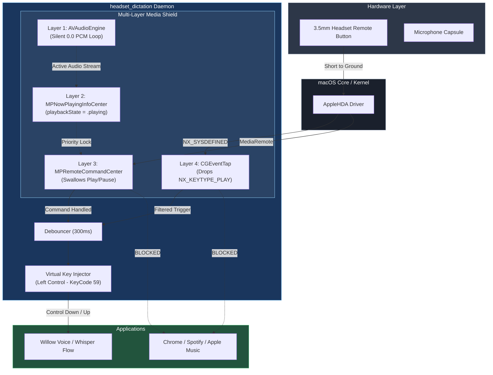

# 🎙️ Headset Dictation Shield

> **Repurpose 3.5mm wired headset buttons into a universal macOS dictation trigger with an active multi-layer media shield.**

[](https://apple.com/macos)
[](https://swift.org)
[](LICENSE)

`headset-dictation` is a lightweight macOS background daemon that intercepts physical inline button presses from wired 3.5mm TRRS headsets (Apple EarPods, Bose, Sony, etc.) and translates them into dictation toggle hotkeys (such as the **Left Control** key for **Willow Voice** or **Whisper Flow**).

It features a **multi-layer media shield** that prevents macOS from routing Play/Pause events to background media players (like Chrome/YouTube, Spotify, Apple Music, or VLC).

---

## 📑 Table of Contents
- [Hardware Architecture & Physics](#-hardware-architecture--physics)
  - [3.5mm TRRS CTIA Pinout](#35mm-trrs-ctia-pinout)
  - [The Push-to-Talk vs. Toggle Conundrum](#the-push-to-talk-vs-toggle-conundrum)
- [macOS Event Pipeline & The Dual Routing Problem](#-macos-event-pipeline--the-dual-routing-problem)
- [Multi-Layer Media Shield Architecture](#-multi-layer-media-shield-architecture)
- [Software Architecture & Flow](#-software-architecture--flow)
- [Quick Start](#-quick-start)
  - [Prerequisites](#prerequisites)
  - [Build & Run](#build--run)
  - [Granting Accessibility Permissions](#granting-accessibility-permissions)
- [Background Service (LaunchAgent)](#-background-service-launchagent)
- [Troubleshooting & Chrome Media Key Isolation](#-troubleshooting--chrome-media-key-isolation)
- [License](#-license)

---

## ⚡ Hardware Architecture & Physics

### 3.5mm TRRS CTIA Pinout

Standard wired 3.5mm headsets follow the **CTIA (Cellular Telecommunications Industry Association)** mechanical standard:

```
        Tip (T)       Ring 1 (R1)     Ring 2 (R2)      Sleeve (S)
      ┌──────────┐  ┌─────────────┐  ┌─────────────┐  ┌──────────────────┐
     /            \/               \/               \/                    \
 ───┤  Left Audio ║  Right Audio   ║    Ground     ║ Mic + Remote Control ├───[ Cable ]
     \            /\               /\               /\                    /
      └──────────┘  └─────────────┘  └─────────────┘  └──────────────────┘
         Pin 1           Pin 2            Pin 3              Pin 4
```

### The Push-to-Talk vs. Toggle Conundrum

In standard CTIA 3.5mm headsets, the inline remote button does **not** send a digital data packet. Instead, it is an analog mechanical switch:

```
                        [Inline Remote Button]
                             ┌───/ ───┐
                             │        │
  Sleeve (Mic Line) ─────────┴────────┼──────────[Electret Mic Capsule]
                                      │
  Ring 2 (Ground)   ──────────────────┴──────────[Ground Reference]
```

* **When Clicked:** The button physically shorts the **Microphone line (Sleeve)** directly to **Ground (Ring 2)** (reducing voltage across the mic line to $\approx 0\text{V}$).
* **macOS Hardware Codec (`AppleHDA`):** Detects the zero-voltage drop and registers it as an inline remote click (`NX_KEYTYPE_PLAY`).

```
⚠️ THE HARDWARE CONSTRAINT:
If you physically HOLD the inline button down to speak ("Push-to-Talk"), the microphone line 
remains shorted to 0V/Ground, completely MUTING the audio signal reaching your computer.
```

#### ✅ Solution: Latching Toggle Mode
The daemon implements a stateful **toggle mode** with software debouncing:
1. **Click 1:** Starts Dictation $\rightarrow$ Software injects virtual key down (`Control Down`) $\rightarrow$ Button is released $\rightarrow$ Mic line returns to normal voltage $\rightarrow$ **You speak with full audio quality**.
2. **Click 2:** Stops Dictation $\rightarrow$ Software injects virtual key up (`Control Up`) $\rightarrow$ Speech-to-text transcribes immediately.

---

## 🔄 macOS Event Pipeline & The Dual Routing Problem

When an inline headset button is clicked, macOS broadcasts the event across **two completely independent pipelines**:

```
                  ┌─────────────────────────────────┐
                  │ 3.5mm Headset Button Clicked    │
                  │ (Sleeve shorted to Ground @ 0V) │
                  └────────────────┬────────────────┘
                                   │
                                   ▼
                  ┌─────────────────────────────────┐
                  │   AppleHDA Audio Kernel Driver  │
                  │   Emits NX_KEYTYPE_PLAY (0x10)  │
                  └────────────────┬────────────────┘
                                   │
         ┌─────────────────────────┴─────────────────────────┐
         │                                                   │
         ▼                                                   ▼
┌─────────────────────────────────┐         ┌─────────────────────────────────┐
│   Pipeline A: WindowServer      │         │   Pipeline B: CoreAudio/IOKit   │
│   (Low-Level GUI Event Stream)  │         │   (nowplayingd & MediaRemote)   │
└────────────────┬────────────────┘         └────────────────┬────────────────┘
                 │                                           │
                 ▼                                           ▼
┌─────────────────────────────────┐         ┌─────────────────────────────────┐
│          CGEventTap             │         │      MPNowPlayingInfoCenter     │
│   (Intercepts & Drops Event)    │         │      MPRemoteCommandCenter      │
└────────────────┬────────────────┘         └────────────────┬────────────────┘
                 │                                           │
                 ▼                                           ▼
┌─────────────────────────────────┐         ┌─────────────────────────────────┐
│   Virtual Left Ctrl Injected    │         │  Play/Pause Intent Consumed     │
│     (Toggles Willow Voice)      │         │  (Chrome/Spotify Never Trigger) │
└─────────────────────────────────┘         └─────────────────────────────────┘
```

### Mermaid Event Sequence

```mermaid
sequenceDiagram
    autonumber
    actor User
    participant Headset as 3.5mm TRRS Button
    participant Kernel as AppleHDA (Kernel)
    participant CG as CGEventTap (Pipeline A)
    participant NP as nowplayingd (Pipeline B)
    participant Daemon as headset_dictation Daemon
    participant Willow as Willow Voice / Whisper Flow
    participant Media as Chrome / Spotify / Music

    User->>Headset: Clicks Inline Remote
    Headset->>Kernel: Shorts Mic to Ground (0V)
    Kernel->>CG: Emits NX_SYSDEFINED / NX_KEYTYPE_PLAY
    Kernel->>NP: Emits MediaRemote Play/Pause Event
    
    rect rgb(20, 35, 20)
        Note over CG,Daemon: Pipeline A Handling
        CG->>Daemon: Intercepts raw HID event
        Daemon-->>CG: Returns nil (Drops event from WindowServer)
        Daemon->>Willow: Posts Virtual Left Control Key Event
    end

    rect rgb(20, 20, 35)
        Note over NP,Media: Pipeline B Handling (Media Shield)
        Daemon->>NP: Claims active NowPlaying + silent audio lock
        NP->>Daemon: Routes Play/Pause command to Daemon
        Daemon-->>NP: Returns .success (Swallows command)
        Note over Media: Media players remain untouched!
    end
```


---

## 🛡️ Multi-Layer Media Shield Architecture

Without an active shield, `nowplayingd` passes media keys to whichever application is actively playing audio (e.g. YouTube in Chrome or a playlist in Spotify). 

`headset-dictation` deploys a **4-Layer Shield**:

```
+-----------------------------------------------------------------------------------+
|                           HEADSET DICTATION DAEMON                                |
|                                                                                   |
|  [ Layer 1: Ghost Audio Session ]                                                 |
|    AVAudioEngine + AVAudioPlayerNode (Looping silent 0.0 PCM buffer)              |
|    --> Registers daemon as an active CoreAudio stream                             |
|                                                                                   |
|  [ Layer 2: NowPlaying Priority Claim ]                                           |
|    MPNowPlayingInfoCenter.default().playbackState = .playing                      |
|    --> Forces nowplayingd to prioritize our daemon over external apps             |
|                                                                                   |
|  [ Layer 3: Remote Command Interceptor ]                                          |
|    MPRemoteCommandCenter (.togglePlayPauseCommand, .playCommand, .pauseCommand)   |
|    --> Swallows media commands & triggers toggleDictation()                       |
|                                                                                   |
|  [ Layer 4: Low-Level HID Filter ]                                                |
|    CGEvent.tapCreate(tap: .cghidEventTap, place: .headInsertEventTap)             |
|    --> Suppresses NX_SYSDEFINED events from propagating to WindowServer           |
+-----------------------------------------------------------------------------------+
```

### Mermaid Architecture Diagram


---

## 🚀 Quick Start

### Prerequisites
- macOS 13.0 (Ventura) or later
- Swift 6.0+ / Xcode Command Line Tools (`xcode-select --install`)

### Build & Run
Clone the repository and compile using `make`:

```bash
git clone https://github.com/matgCodes/headset-dictation.git
cd headset-dictation

# Build and run directly in foreground
make run
```

### Granting Accessibility Permissions
Because the daemon creates a low-level `CGEventTap` and synthesizes `CGEvent` key presses, macOS requires **Accessibility** permissions:

1. Open **System Settings $\rightarrow$ Privacy & Security $\rightarrow$ Accessibility**.
2. Enable your **Terminal** app (or `headset_dictation` binary).
3. If permissions were missing on first run, restart the process.

---

## ⚙️ Background Service (LaunchAgent)

To have `headset-dictation` start automatically at login and run silently in the background:

```bash
# Install and start LaunchAgent
make install

# Check logs
tail -f /tmp/headset_dictation.log

# Uninstall LaunchAgent
make uninstall
```

The installer configures `~/Library/LaunchAgents/com.user.headsetdictation.plist` with `RunAtLoad` and `KeepAlive` enabled.

---

## 🔧 Troubleshooting & Chrome Media Key Isolation

### Chrome / Chromium Hardware Media Key Hook
Modern Chromium browsers (Google Chrome, Brave, Arc, Edge) can attach directly to macOS IOKit hardware media keys. While our daemon's `AVAudioEngine` lock isolates media keys in 99% of configurations, you can completely isolate Chromium by disabling hardware key interception:

1. Open Chrome and navigate to:
   ```
   chrome://flags/#hardware-media-key-handling
   ```
2. Change the setting from **Default** to **Disabled**.
3. Relaunch Chrome.

---

## 📄 License

MIT License. See [LICENSE](LICENSE) for details.
