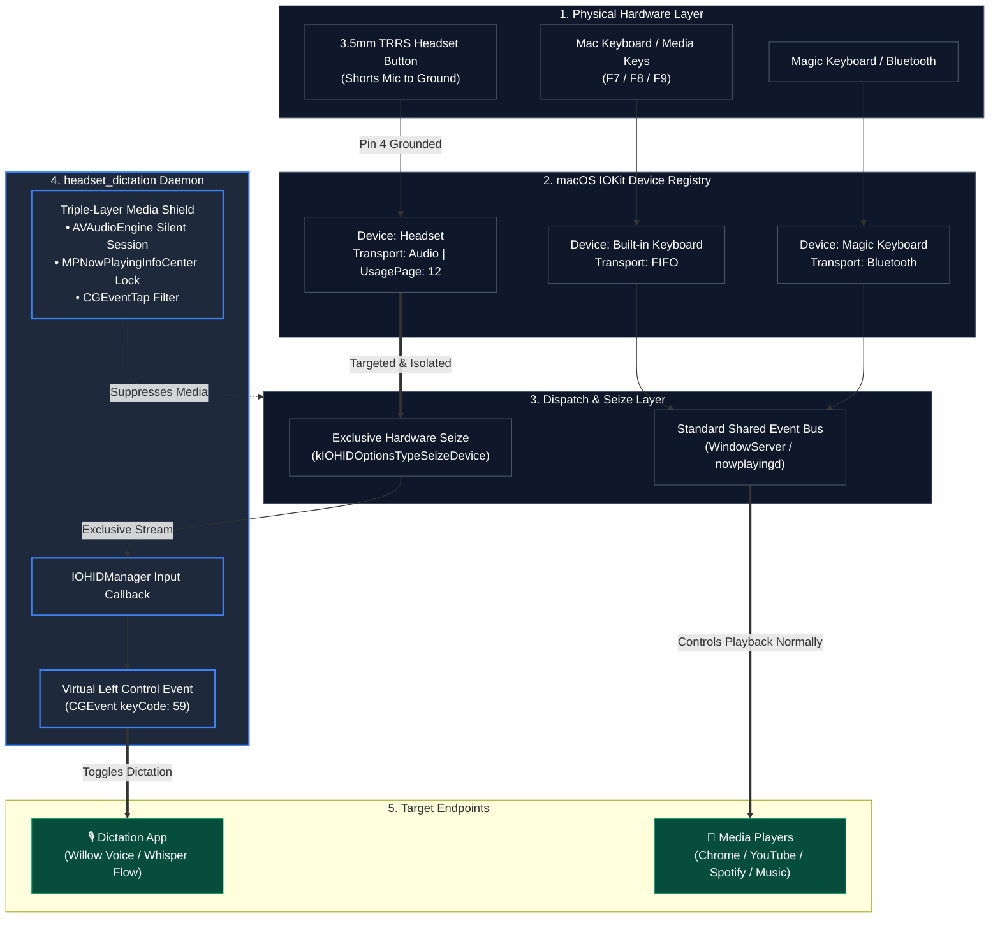
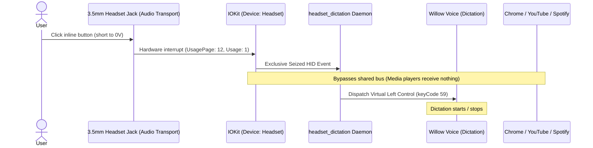
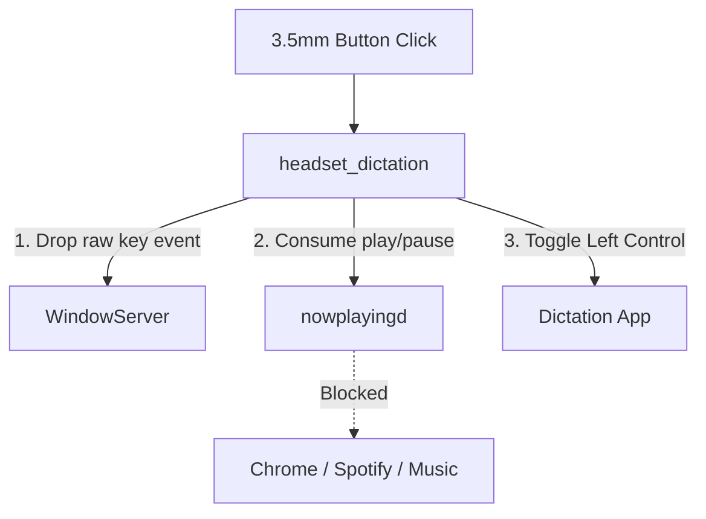

# Headset Dictation

Use a wired 3.5mm headset button to toggle dictation on macOS without triggering media players.

This daemon intercepts the inline button on standard 3.5mm TRRS headsets (Apple EarPods, Bose, etc.) and converts clicks into a keyboard shortcut (Left Control) for dictation apps like Willow Voice or Whisper Flow. It also blocks macOS from routing the click as a Play/Pause command to apps like Chrome, Spotify, or Apple Music.

---

## Table of Contents
- [Hardware Details](#hardware-details)
  - [3.5mm TRRS (CTIA) Pinout](#35mm-trrs-ctia-pinout)
  - [Why Hold-to-Talk Does Not Work](#why-hold-to-talk-does-not-work)
- [macOS Event Routing](#macos-event-routing)
- [Media Key Interception](#media-key-interception)
- [How It Works](#how-it-works)
- [Quick Start](#quick-start)
  - [Requirements](#requirements)
  - [Build and Run](#build-and-run)
  - [Accessibility Permissions](#accessibility-permissions)
- [Running as a Background Service](#running-as-a-background-service)
- [Chrome Media Key Handling](#chrome-media-key-handling)
- [License](#license)

---

## Hardware Details

### 3.5mm TRRS (CTIA) Pinout

Standard 3.5mm wired headsets use the CTIA pinout:

```
        Tip (T)       Ring 1 (R1)     Ring 2 (R2)      Sleeve (S)
      ┌──────────┐  ┌─────────────┐  ┌─────────────┐  ┌──────────────────┐
     /            \/               \/               \/                    \
 ───┤  Left Audio ║  Right Audio   ║    Ground     ║ Mic + Remote Control ├───[ Cable ]
     \            /\               /\               /\                    /
      └──────────┘  └─────────────┘  └─────────────┘  └──────────────────┘
         Pin 1           Pin 2            Pin 3              Pin 4
```

### Why Hold-to-Talk Does Not Work

The inline remote button is a mechanical switch connected between the microphone line and ground:

```
                        [Inline Remote Button]
                             ┌───/ ───┐
                             │        │
  Sleeve (Mic Line) ─────────┴────────┼──────────[Mic Capsule]
                                      │
  Ring 2 (Ground)   ──────────────────┴──────────[Ground Reference]
```

- When you press the button, it shorts the **Mic line (Sleeve)** directly to **Ground (Ring 2)**, pulling the line to 0V.
- The audio hardware (`AppleHDA`) detects this voltage drop and emits a play/pause media event (`NX_KEYTYPE_PLAY`).
- Because holding the button grounds the mic line, the microphone is muted for the entire duration of the press.

**Toggle Mode:**
Instead of hold-to-talk, the listener uses click-to-toggle:
1. **First click:** Sends `Control Down` to start dictation. Releasing the button un-grounds the mic so you can speak normally.
2. **Second click:** Sends `Control Up` to stop dictation and start transcription.

---

## macOS Event Routing & Hardware Isolation

macOS registers the 3.5mm headphone jack as an independent input device (`Transport: Audio`, `Product: Headset`, `UsagePage: 12`) distinct from the built-in keyboard (`Transport: FIFO`) or Bluetooth peripherals (`Transport: Bluetooth`).



### Event Sequence


---

## Media Key Interception & Shielding Architecture

To keep media apps from responding when you click the headset button, the daemon handles four distinct layers:

```
+-----------------------------------------------------------------------------------+
|                              HEADSET DICTATION DAEMON                             |
|                                                                                   |
|  1. IOHIDManager (Exclusive Seize)                                                |
|     Opens the "Headset" device exclusively (kIOHIDOptionsTypeSeizeDevice) to      |
|     prevent Chromium and nowplayingd from receiving raw hardware events.          |
|                                                                                   |
|  2. AVAudioEngine (CoreAudio Lock)                                                |
|     Plays a silent, looping PCM buffer so CoreAudio treats this process as        |
|     an active audio source.                                                       |
|                                                                                   |
|  3. MPNowPlayingInfoCenter                                                        |
|     Sets playbackState = .playing so nowplayingd routes media keys here first.    |
|                                                                                   |
|  4. CGEventTap                                                                    |
|     Intercepts NX_SYSDEFINED / NX_KEYTYPE_PLAY events and returns nil to stop     |
|     propagation through WindowServer.                                             |
+-----------------------------------------------------------------------------------+
```

### Flow Diagram


---

## How It Works

1. The daemon starts a silent `AVAudioEngine` and marks its playback state as active in `MPNowPlayingInfoCenter`.
2. A low-level `CGEventTap` listens for `NX_SYSDEFINED` events with subtype `NX_SUBTYPE_AUX_CONTROL_BUTTONS` and key code `NX_KEYTYPE_PLAY`.
3. When a click occurs:
   - It debounces events within 300ms to avoid double-triggers.
   - It toggles internal recording state.
   - It injects a virtual Left Control key press (`keyCode: 59`) to start or stop dictation.
   - It consumes the media event so other apps do not pause or play.

---

## Quick Start

### Requirements
- macOS 13.0+
- Swift compiler (`xcode-select --install` or Xcode)

### Build and Run

```bash
git clone https://github.com/matgCodes/headset-dictation.git
cd headset-dictation

# Build and run
make run
```

### Accessibility Permissions

The daemon needs Accessibility access to create the event tap and post virtual keystrokes:

1. Open **System Settings -> Privacy & Security -> Accessibility**.
2. Add and enable your terminal application (or the `headset_dictation` binary).
3. If running for the first time, restart the terminal after enabling access.

---

## Running as a Background Service

To run the listener in the background and start it automatically at login:

```bash
# Install and load the LaunchAgent
make install

# View logs
tail -f /tmp/headset_dictation.log

# Stop and uninstall
make uninstall
```

The service plist is placed at `~/Library/LaunchAgents/com.user.headsetdictation.plist`.

---

## Chrome Media Key Handling

If Chromium browsers (Chrome, Brave, Arc, Edge) still capture media keys via raw IOKit hooks:

1. Go to `chrome://flags/#hardware-media-key-handling` in the browser.
2. Set the flag to **Disabled**.
3. Relaunch the browser.

---

## License

MIT. See [LICENSE](LICENSE).
