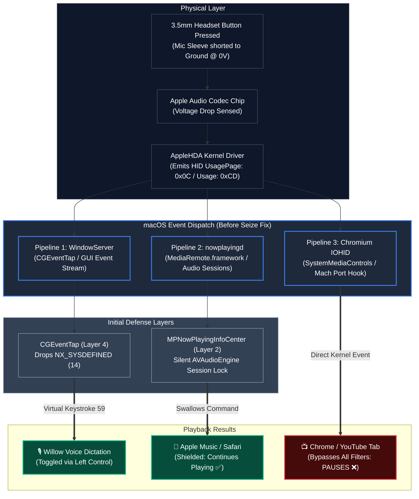
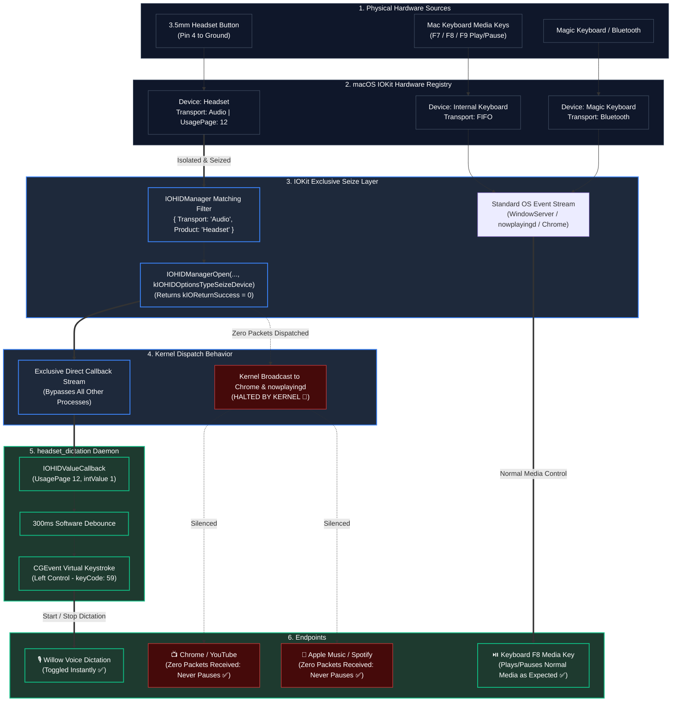

# Case Study: Solving the Chromium IOHID Media Key Bypass via Hardware Seize Mode

## Executive Summary
Repurposing the physical inline remote button on a wired 3.5mm TRRS headset to toggle speech-to-text dictation (Willow Voice / Left Control) uncovered a deep macOS event dispatch quirk: **Chromium browsers (Google Chrome, Brave, Arc, Edge) completely bypass WindowServer and `nowplayingd` to capture hardware media keys directly from the kernel.**

This document details the hardware mechanics, the tri-pipeline event flow, why conventional filters and browser flags were insufficient, and how native **IOKit Hardware Device Seize Mode (`kIOHIDOptionsTypeSeizeDevice`)** provided a clean, 100% universal system-level solution.

---

## 1. Physical & Electrical Hardware Mechanics

### 3.5mm TRRS (CTIA) Pinout & Switch Behavior
Standard wired 3.5mm mobile headsets use the CTIA pinout standard:

```
        Tip (T)       Ring 1 (R1)     Ring 2 (R2)      Sleeve (S)
      ┌──────────┐  ┌─────────────┐  ┌─────────────┐  ┌──────────────────┐
     /            \/               \/               \/                    \
 ───┤  Left Audio ║  Right Audio   ║    Ground     ║ Mic + Remote Control ├───[ Cable ]
     \            /\               /\               /\                    /
      └──────────┘  └─────────────┘  └─────────────┘  └──────────────────┘
         Pin 1           Pin 2            Pin 3              Pin 4
```

```
                        [Inline Remote Button]
                             ┌───/ ───┐
                             │        │
  Sleeve (Mic Line) ─────────┴────────┼──────────[Mic Capsule]
                                      │
  Ring 2 (Ground)   ──────────────────┴──────────[Ground Reference (0V)]
```

* **Signaling:** Pressing the inline remote button mechanically shorts **Pin 4 (Sleeve)** directly to **Pin 3 (Ground)**, pulling the microphone DC bias line to 0V.
* **Audio Codec Sensing:** The Apple Audio Hardware Codec detects the voltage drop on the sense line and emits an interrupt to the `AppleHDA` kernel extension.
* **Acoustic Constraint:** Because holding the button down physically grounds the microphone line to 0V, the microphone capsule is completely muted during physical contact. To allow crystal-clear audio recording through the headset microphone, the software must operate in **Toggle Mode (Click to Start $\rightarrow$ speak freely $\rightarrow$ Click to Stop)** rather than Push-to-Talk.

---

## 2. The Problem: The Tri-Pipeline Routing Dilemma

When the hardware button is clicked, macOS broadcasts the raw HID Consumer event across three distinct pipelines:



### Why Previous Shield Layers Failed on Chromium
1. **`CGEventTap`:** Sits at the WindowServer layer. Chromium's `SystemMediaControls` spawns its own `IOHIDEventSystemClientCreate` listener in C++, reading the raw Mach port stream directly from the kernel before/alongside WindowServer.
2. **`MPNowPlayingInfoCenter` & `AVAudioEngine`:** Successfully shields native macOS media players (Apple Music, Spotify, Safari) by claiming NowPlaying priority in `nowplayingd`. However, Chromium ignores `nowplayingd` entirely when its internal hardware key hook is active.
3. **Browser Flag (`chrome://flags/#hardware-media-key-handling`):** While setting this flag to `Disabled` stops Chrome from hooking IOKit, it is a fragile, per-browser setting that does not scale across multiple browsers or app updates.

---

## 3. The Discovery: Hardware Transport Stream Isolation

Inspecting the low-level macOS IOKit hardware registry revealed that macOS treats the wired 3.5mm headphone jack as its own **dedicated, isolated hardware input device**:

| Device Name | Manufacturer | Transport | Usage Page | Usage | Description |
| :--- | :--- | :--- | :--- | :--- | :--- |
| **`Headset`** | **`Apple`** | **`Audio`** | **`12 (Consumer)`** | **`1 (Controls)`** | **3.5mm Headphone Jack Inline Remote** |
| `Apple Internal Keyboard` | `Apple` | `FIFO` | `1 (Generic Desktop)` | `6 (Keyboard)` | MacBook Built-in Keyboard |
| `Magic Keyboard` | `Apple Inc.` | `Bluetooth` | `1 (Generic Desktop)` | `6 (Keyboard)` | External Bluetooth Keyboard |
| `Magic Mouse` | `Apple Inc.` | `Bluetooth` | `1 (Generic Desktop)` | `2 (Mouse)` | External Bluetooth Mouse |

Because the 3.5mm headset is isolated on **`Transport: Audio`**, we can target that specific hardware port without affecting any other input device on the system.

---

## 4. The Solution: Exclusive Hardware Seize Mode

Using Apple's native `IOKit.hid` framework in Swift, we open the `Headset` device in **`kIOHIDOptionsTypeSeizeDevice`** mode.



---

## 5. Implementation Code

```swift
import Cocoa
import CoreGraphics
import IOKit
import IOKit.hid

let CONTROL_KEY_CODE: CGKeyCode = 59 // Left Control
var isRecording = false
var lastToggleTime = Date.distantPast

func sendControlState(down: Bool) {
    let src = CGEventSource(stateID: .hidSystemState)
    let event = CGEvent(keyboardEventSource: src, virtualKey: CONTROL_KEY_CODE, keyDown: down)
    event?.flags = down ? .maskControl : []
    event?.post(tap: .cghidEventTap)
}

func toggleDictation() {
    let now = Date()
    if now.timeIntervalSince(lastToggleTime) < 0.3 { return } // 300ms debounce
    lastToggleTime = now
    
    isRecording.toggle()
    sendControlState(down: isRecording)
}

// 1. Create IOHIDManager
let hidManager = IOHIDManagerCreate(kCFAllocatorDefault, IOOptionBits(kIOHIDOptionsTypeNone))

// 2. Target exclusively the 3.5mm Headset audio transport
let matchingDict: [String: Any] = [
    kIOHIDTransportKey as String: "Audio",
    kIOHIDProductKey as String: "Headset"
]
IOHIDManagerSetDeviceMatching(hidManager, matchingDict as CFDictionary)

// 3. Register hardware input callback
let hidCallback: IOHIDValueCallback = { context, result, sender, value in
    let element = IOHIDValueGetElement(value)
    let usagePage = IOHIDElementGetUsagePage(element)
    let intValue = IOHIDValueGetIntegerValue(value)

    if usagePage == 12 && intValue == 1 { // Consumer control down
        toggleDictation()
    }
}
IOHIDManagerRegisterInputValueCallback(hidManager, hidCallback, nil)
IOHIDManagerScheduleWithRunLoop(hidManager, CFRunLoopGetCurrent(), CFRunLoopMode.defaultMode.rawValue)

// 4. Open in EXCLUSIVE SEIZE mode
let status = IOHIDManagerOpen(hidManager, IOOptionBits(kIOHIDOptionsTypeSeizeDevice))
guard status == kIOReturnSuccess else {
    fatalError("Failed to seize headset device: \(status)")
}

NSApplication.shared.run()
```

---

## 6. Key Takeaways & Architecture Guidelines

1. **Hardware-Level Seizing beats Software-Level Filtering:** When dealing with applications that bypass user-space event pipelines (like Chromium hooking IOKit directly), filtering at the WindowServer (`CGEventTap`) or MediaRemote (`nowplayingd`) layer is insufficient. Seizing the device at the IOKit boundary stops the event before any userland process can observe it.
2. **Precision Device Targeting:** Because Apple audio hardware isolates the 3.5mm jack under `Transport: Audio`, seizing the headset leaves all keyboard media keys (F7–F9) and Bluetooth headsets completely unaffected.
3. **Hotplug Resilience:** `IOHIDManager` automatically handles plugging and unplugging 3.5mm headsets dynamically via run loop scheduling.
4. **Zero-Configuration System Daemon:** No browser flags, third-party drivers, or per-application settings are required.
